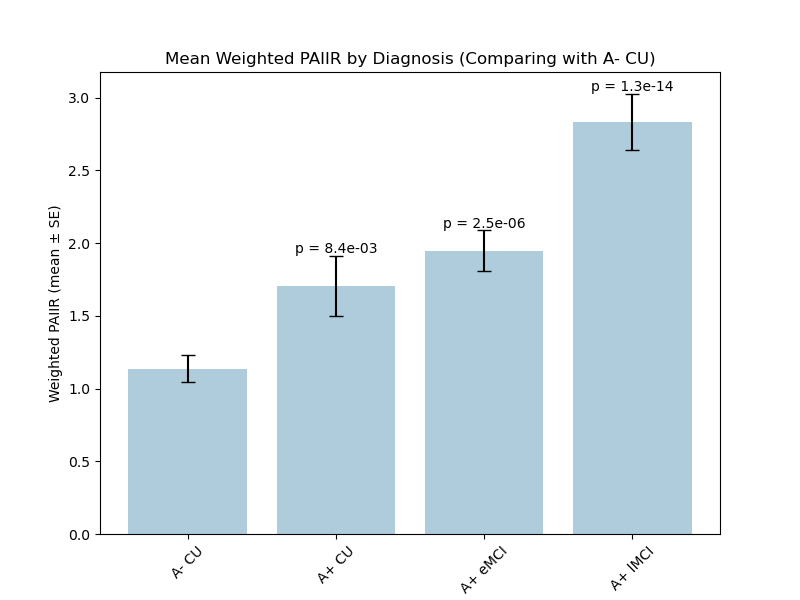

**********************************************
DeepAtrophy Package Usage
**********************************************

Deepatrophy package provides a set of modules to perform longitudinal analysis from the scratch. The package is designed to be adapted to different datasets. The package is organized into the following modules:
 - necktrim: to perform neck trimming on each single MRI image.
 - global Alignment: to globally align structures for each image pair.
 - deep_atrophy_train: model training. Optimize for Scan Temporal Order (STO) loss and Relative Interscan Interval (RISI) loss.
 - deep_atrophy_test: model test. Predict STO and RISI accuracy. In addition, log the last layer of the deep learning part of the model for final Predicted-to-Actual Interscan Interval Rate (PAIIR) prediction.
 - PAIIR: Use the healthy control group (in the case of Alzheimer's disease analysis, Amyloid negatice cognitively unimpaired group) to predict the interscan interval of each image pair. The predicted interscan interval is called Predicted Interscan Interval Rate (PII). PAIIR is calculated as PII/Actual Interscan Interval. The PAIIR is used as a surrogate biomarker for progression rate of each image pair. The progression rate for each subject is computed using a linear mixed effect model. It is then compared between different groups.

Requirements
============
* deepatrophy package installed.
* A directory containing dataset images in pyramid format. We will assume that the path to this directory on your Linux machine is ``deepatrophy/dataset``.

Preprocessing your Dataset
=============================

If you have longitudinal MRI images, you might want to do the following preprocessing steps:
1. neck trimming
2. Rigidly register longitudinal images, so that they are aligned in the same space.
3. Crop the images to a specific brain structure, such as the hippocampus.

Our package provides tools to perform these preprocessing steps. All example code to execucate the deepatrophy package is located in folder ``deepatrophy/tools``. Illustrations of these scripts are displayed here.

Neck trimming
----------------

After installing the package, you can perform neck trimming with a single command line. Suppose the ``$input_image`` is of format ``.nii`` or ``.nii.gz``, run the following command to trim the neck of the images:

.. code-block:: bash

    python3 -m deepatrophy neck_trim --input-image $input_image \
        --trimmed-image $trimmed_image \
        --workdir $workdir

In this script, specify the path and name of trimmed images in ``$trimmed_image``. For batch preprocessing of images, you can refer to scripts in ``deepatrophy/tools/run_prep_single_image.sh`` and adapt as your needs.

Longitudinal Alignment (Rigid Registration) and Cropping
---------------------------------------------------------    

For all scans at different times of the same subject, DeepAtrophy perform analysis for each possible image pair. The direction of image pairs can be in the forward order, or the reverse order. 

All images are first rigidly registered to a template space, and then all scans at different times of the same subject are registered to each other. We provide a template whole brain image for brain analysis, but you can use your own template image. 
If you want to crop images to a specific brain structure (optional), you can provide a template mask image. We provide the medial temporal lobe and hippocampus segmentation in the brain on the template as an example, and crop images to the left and right side.

For each image pair, you can perform rigid registration using the following command:

.. code-block:: bash

    python3 -m deepatrophy obtain_image_pair --baseline-image $baseline_image \
        --followup-image $followup_image \
        --workdir $workdir \
        --prefix $prefix \
        --template-image $template_image \
        --template-mask $template_seg \
        --get-ROI \
        --side left

Here, ``$baseline_image`` and ``$followup_image`` are the paths to the baseline and follow-up images, respectively. The ``$workdir`` is the directory where the output images will be saved. The ``$prefix`` is the prefix of the output images. The ``$template_image`` is the full path and file name of the template image, and the ``$template_seg`` is the full path and file name to the template mask image. The ``--get-ROI`` flag is used to crop the images to the specific brain structure. The ``--side`` flag is used to specify the side of the brain structure to crop. The side can be either ``left`` or ``right``. The ``--get-ROI`` and ``--side`` flag can be omitted if you don't want to crop images.

For batch preprocessing of images, you can refer to scripts in ``deepatrophy/tools/run_prep_image_pairs.sh`` and adapt as your needs.

Preparing your Dataset
=============================
After preprocessing the dataset, we can now prepare the dataset for training and testing.
Dataset is split to training, evaluation, and test set. Each example in for deepatrophy model is a longitudinal image pair of the same subject. They can be organized into train.csv and test.csv files, both of which includes the following columns:

- ``baseline_path``: path to the baseline image file.
- ``followup_path``: path to the followup image file.
- ``mask_path``: path to the mask file.
- ``subject_id``: unique identifier for the subject.
- ``bl_time``: scan time of the baseline image.
- ``fu_time``: scan time of the baseline image.

The dataset can be split into training and test set using the following code: ``deepatrophy/tools/train_test_split.py`` This code also includes creation of train.csv and test.csv files.

.. todo:: Add path of code.

Training the model
=============================

We can now train the model using the following command:

.. code-block:: bash

    python3 -m deepatrophy run_training --train-double-pairs $DATA_DIR/csv_list_train_double_pair.csv \
        --eval-double-pairs $DATA_DIR/csv_list_eval_double_pair.csv \
        --test-double-pairs $DATA_DIR/csv_list_test_double_pair.csv \
        --train-pairs $DATA_DIR/csv_list_train_pair.csv \
        --eval-pairs $DATA_DIR/csv_list_eval_pair.csv \
        --test-pairs $DATA_DIR/csv_list_test_pair.csv \
        --ROOT "/data/mengjin/DeepAtrophyPackage/DeepAtrophy/out"

Here, ``$DATA_DIR`` can be '/data/mengjin/DeepAtrophyPackage/DeepAtrophy/files'. In this folder, ``$DATA_DIR/csv_list_train_double_pair.csv``, ``$DATA_DIR/csv_list_eval_double_pair.csv``, and ``$DATA_DIR/csv_list_test_double_pair.csv`` are the paths to the training, evaluation, and test set, respectively. They are created before running the ``run_training`` module of the script (WHERE??). The ``$ROOT`` is the root directory where the model will be saved.

This command will train the model using the training set and evaluate the model using the evaluation set. The model will be saved in the ``$ROOT`` directory. Additional arguments can be provided directly to this script, and options to specify the trained model are available in ``deepatrophy/src/deepatrophy/deep_atrophy_train.py``. If not specified, hyperparameters such as the number of epochs, batch size, etc., will be set as default.

If you have a pretrained model and you would like to continue training from that model, you can add the following argument to the command:

.. code-block:: bash

    --resume-all "/data/mengjin/DeepAtrophyPackage/DeepAtrophy/DeepAtrophy/Model/xxx.pth"

The output model will be saved with the same model name, with the epochs updated in the model name.

Test the model
=============================

We can now test the model using the following command:

.. code-block:: bash

    python3 -m deepatrophy run_test \
        --train-pairs $DATA_DIR/csv_list_train_pair.csv \
        --eval-pairs $DATA_DIR/csv_list_eval_pair.csv \
        --test-pairs $DATA_DIR/csv_list_test_pair.csv \
        --resume-all "/data/mengjin/DeepAtrophyPackage/DeepAtrophy/DeepAtrophy/Model/xxx.pth" \
        --ROOT "/data/mengjin/DeepAtrophyPackage/DeepAtrophy/DeepAtrophy"

In this code, ``--resume-all`` is the path to the trained model. The ``--ROOT`` will be the folder where the output of the test script will be saved. The test script will test the model using the test set. The deepatrophy run_test will provide STO accuracy for each image pair, and RISI accuracy for each double-image-pairs. The last layer of the deep learning part of the model will be logged in the test stage, and will be analyzed for final Predicted-to-Actual Interscan Interval Rate (PAIIR) prediction in next Section, Analysis of the Results. The output of this test script will be two spreadsheets for each dataset partition. For example, for the test set, it will output one spreadsheet for STO prediction and the five numbers in the last layer of the deep learning network, and another spreadsheet for RISI prediction. In the second spreadsheet, no intermediate output is logged. The output of the test script will be saved in the ``$ROOT`` directory.

Analysis of the Results
=============================

After testing the model, we obtain scores of the last layer of deep learning model for each Longitudinal image pair in the test set. We can now generate Predicted Interscan Interval (PII) scores for **each image pair** using linear regression. 

.. code-block:: bash

    python3 -m deepatrophy PAIIR --train-pair-spreadsheet $train_spreadsheet \
            --test-pair-spreadsheet $test_spreadsheet \
            --test-double-pair-spreadsheet $test_double_pair_spreadsheet \
            --workdir $workdir \
            --prefix $prefix \
            --min-date 180 \
            --max-date 400

In addition, this code provides a single progression rate when **a subject** has multiple scans. For our study, we have grouped subjects into different Alzheimer's disease diagnostic stages according to severity, and compared the progression rates between groups. You can adjust groups as you need. To add information to the spreadsheet, you need to merge it with another spreadsheet with demographics information of the subjects. This part of code is not provided in the example code package.

We can now generate a scatter plot of the predicted vs. actual PII scores.

We can also perform some analysis based on the dataset, such as observing if there's any difference in different diagnostic groups.

